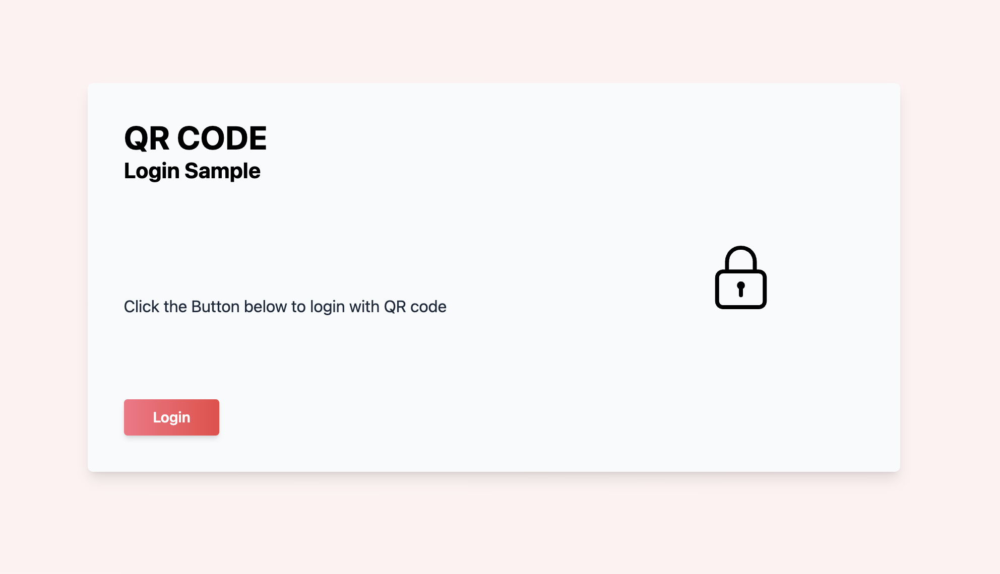
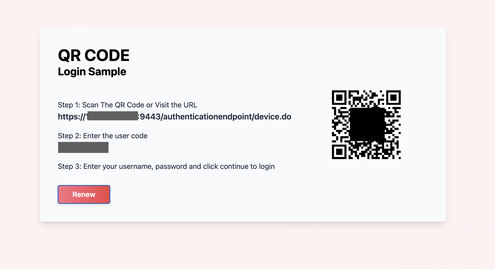
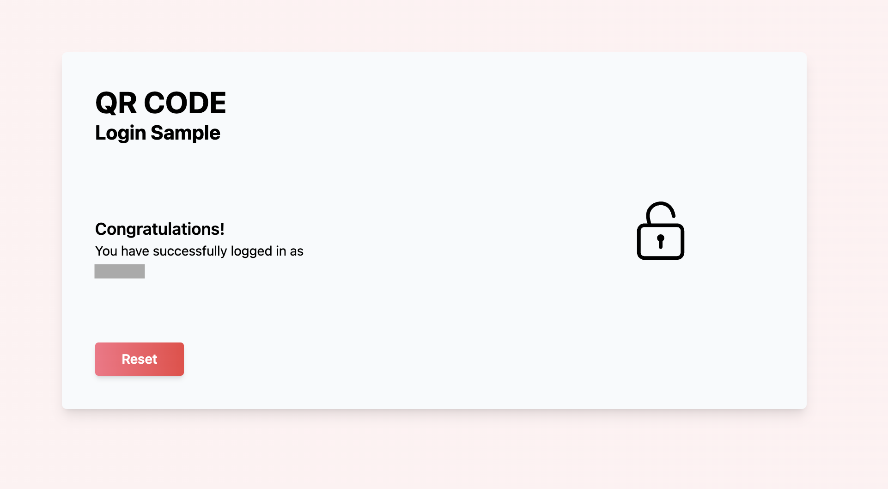

# QR Code Login sample application using Device Authorization grant

This project is a sample implementation of QR code-based authentication using the OAuth 2.0 device authorization grant (RFC 8628).

## How to Run

### Configurations

In the project directory, find `index.js` file in the `./src/config` directory. Provide the HOST, PORT and CLIENT_ID. A sample config is shown below.

```
const IDP_HOST = '10.0.0.100' // ex: localhost or 192.168.1.200 or example.com;
const IDP_PORT = '9443' // default port for WSO2 IS is 9443;

export const IDP_BASE_URL = `https://${IDP_HOST}:${IDP_PORT}`;

export const IDP_DEVICE_AUTH_URL = `https://${IDP_HOST}:${IDP_PORT}/oauth2/device_authorize`; // WSO2 IS default device authorize endpoint
export const IDP_TOKEN_URL = `https://${IDP_HOST}:${IDP_PORT}/oauth2/token`; // WSO2 IS default token endpoint

export const CLIENT_ID = 'myVerySecretClientKey'; //CLIENT_ID of the Application

export const GRANT_TYPE = 'urn:ietf:params:oauth:grant-type:device_code';
```

Once configuration is complete, move to the root directory of the project and run the following command.

### `npm install`

And then run following command

### `npm start`

This will run the application in development mode. Visit [http://localhost:3000](http://localhost:3000) on a browser to experience the application. A UI similar to below should appear on the browser window if everything is configured correctly.



## Testing the QR code authentication with application
For this to be tested out two devices connected to a LAN are required. Make sure that WSO2 IS is accessible through the firewall of the hosted PC.
Open up the sample application on a browser window on the first device.
1. Click the Login button.
2. A QR code will be displayed.



3. Scan the QR code displayed in the application from the second device. Click on Reset if you want to generate a new user code.
4. It will redirect to a page with the user code pre-entered. Click Continue. (At this point you may be provided with a message mentioning that the connection is not private. Click on Advance and proceed).
5. Enter the username and password and click Continue.
6. A success message with the logged-in username will be displayed in the application.

